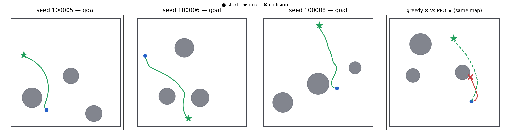
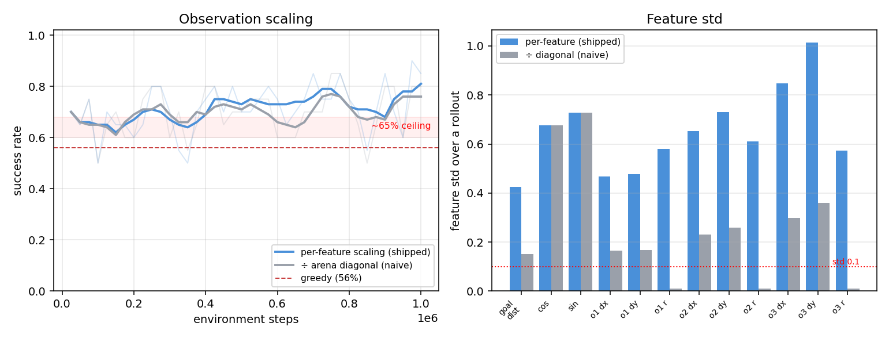
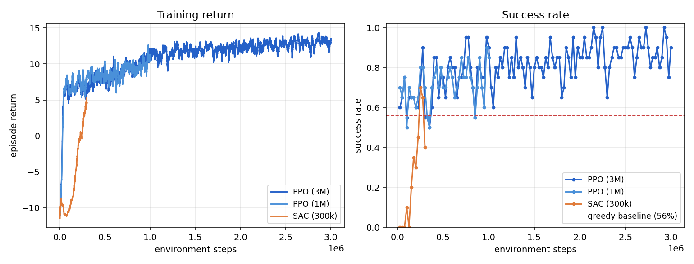
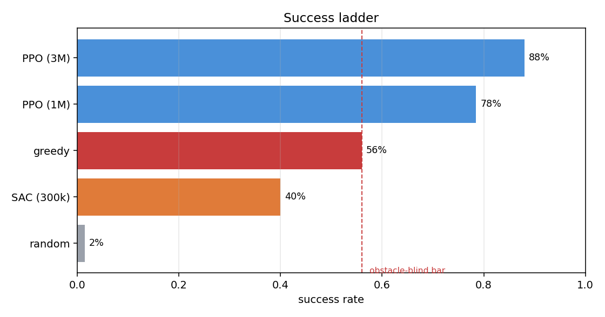

# Reinforcement Learning for 2D Point-to-Point Navigation

## Introduction

The goal of this project is to teach a small mobile robot to drive itself from an
arbitrary starting point to an arbitrary goal on a flat plane, while steering
clear of a handful of obstacles in the way.

The robot lives in a 10×10 square arena and behaves like a **unicycle**: at every
0.1-second step it chooses how fast to drive forward and how quickly to turn, and
the simulator integrates that motion forward. Each episode generates a
random start, a random goal at least half the arena away, and three static
circular obstacles of random size and position dropped in between. Because nothing
is fixed across episodes, the agent cannot memorize a particular map; it has to
learn a *general* strategy for heading toward a goal and flowing around whatever
obstacles happen to be in the path. An episode ends when the robot reaches the
goal (success), touches an obstacle or wall (collision), or runs out of time
(timeout).

*The trained agent (green) driving from start to goal on three different
random maps, curving smoothly around obstacles. The right panel overlays the same
map twice: an obstacle-blind controller drives straight and crashes,
while our agent detours and arrives (dashed).*

**How the robot sees the world.** The observation is deliberately small: twelve
numbers, all expressed relative to the robot itself rather than in absolute world
coordinates. Two numbers encode the goal (its distance, and its bearing written as
a cosine/sine pair so there is no discontinuity when the goal swings from front to
back), and the remaining nine describe the three obstacles, each by its relative
position and radius. The obstacles are always sorted nearest-first, so a given slot
in the vector always carries the same *meaning* ("the closest threat") instead of
an arbitrary spawn order. Keeping everything ego-centric is what lets a policy
trained on random maps generalize: the situation "goal ahead, obstacle to my right"
looks identical no matter where in the arena it occurs.

One seemingly minor choice in this observation turned out to be decisive: how the
distances are scaled before they reach the network. Dividing every length by the
arena's diagonal is the tidy, obvious option, but it crushes the obstacle and
radius channels down to a standard deviation of about 0.01, effectively invisible
next to the goal signal, and caps success near 65 %. Scaling each feature onto a
comparable range instead lifts the same PPO agent well past that ceiling.

*Left: the identical PPO setup trained on the two scalings; the naive version
plateaus around the 65 % ceiling. Right: per-feature standard deviations. Under
naive scaling, the obstacle-radius channels (o1 r, o2 r, o3 r) all but vanish.*

**How the robot is rewarded.** The reward has two parts. A dense *progress* term
pays the robot for every bit of distance it closes on the goal, which gives it a
gradient to follow from the very first step. On top of that sit sparse terminal
rewards: **+10** for reaching the goal, **−10** for a collision, and **−5** for a
timeout. The progress term is written so that it "telescopes": over a full episode
it sums to exactly the start-to-goal distance covered, which quietly closes off
the most common form of reward hacking in navigation tasks: an agent cannot inflate
its score by oscillating back and forth, because every step toward the goal earns
precisely what a step away costs. The equal magnitudes of the goal and collision
rewards keep the agent from becoming either reckless or paralysed, and the small
per-step penalty nudges it toward short, direct paths.

**The algorithms.** We train two of the standard deep-RL algorithms, both taken
from the well-tested [Stable-Baselines3](https://stable-baselines3.readthedocs.io)
(SB3) library so that effort goes into designing the problem rather than
re-implementing optimizers. The first is **PPO** (Proximal Policy Optimization), an
on-policy method that is the reliable workhorse of continuous control and
parallelizes across many simulated environments — a natural fit for cheap CPU
rollouts. The second is **SAC** (Soft Actor-Critic), an off-policy method that
reuses past experience from a replay buffer and is usually more sample-efficient.
Both use small two-layer perceptrons; the observation is only twelve numbers, so a
larger network would mostly just slow training down.

## How each agent performs

**PPO learns the task quickly and well.** After one million environment steps
(about three minutes on the CPU) it reaches **78 % success with zero timeouts**,
and extending training to three million steps pushes it to **88 %**. Its only
failure mode is the occasional collision; it never simply gives up and times out.
Just as importantly, the paths it produces are efficient (it drives about 0.96 of
the straight-line optimum), so it is not buying success with wild, wasteful
detours. The comparison that gives these numbers meaning is a scripted "greedy"
controller that drives straight at the goal and ignores obstacles entirely: it
succeeds only 56 % of the time, and the gap between 56 % and PPO's score *is* the
obstacle-avoidance skill the agent has genuinely learned.

*Episode return (left) and evaluation success rate (right) over training. PPO
(blue) climbs fast and settles well above the greedy baseline; SAC (orange) starts
later and is still rising when its budget runs out.*

**SAC learns more slowly and did not finish.** Within its 300k-step budget SAC
reaches only **40 %**, and the shape of its failures is revealing: an unusually high
**18 % of episodes end in timeout**, meaning the robot often wanders cautiously
without ever committing to the goal. This is the flip side of the "freezing"
temptation the reward is designed to resist, and here an under-trained SAC has not
yet learned its way out of it. Crucially, its success curve is still climbing
steeply at the end of training: the run was stopped short, not converged.

## Training cost

Everything runs on CPU with single-threaded PyTorch and small networks. The one
number worth dwelling on is throughput: PPO collects experience from eight parallel
environments at once and moves at several thousand steps per second, whereas SAC
runs a single environment and takes a gradient step for every environment step,
which makes each step far more expensive in wall-clock terms.

| Run | Algorithm | Steps | Wall-clock | Throughput |
|---|---|--:|--:|--:|
| PPO (1M) | PPO | 1,000,000 | 2.7 min | ~6,100 steps/s |
| PPO (3M) | PPO | 3,000,000 | 10.1 min | ~5,000 steps/s |
| SAC (300k) | SAC | 300,000 | 50.6 min | ~100 steps/s |

## Comparison

*Success rate over 200 fixed evaluation maps. PPO clears the obstacle-blind greedy
bar comfortably; SAC, at its current budget, sits below it.*

Taken at face value the ladder makes PPO the clear winner: it is both more
accurate and dramatically faster to train on this hardware. But the comparison is
not entirely fair to SAC. On CPU, PPO's parallel, on-policy design simply suits the
problem better, and SAC pays a steep wall-clock price for its per-step gradient
updates. The 40 % figure reflects an **under-trained** agent that was still
improving, not a fundamental ceiling: off-policy methods like SAC are typically
*more* sample-efficient than PPO, and given a training budget comparable to PPO's
(several hundred thousand more steps) SAC would very likely become competitive, and
possibly stronger per environment step. In short, PPO won the race as it was run,
but SAC never got to finish it.

## How we could push performance further

Several avenues could raise the numbers above, in rough order of expected payoff:

- **Simply train SAC longer.** Its curve was still rising, so the cheapest win is
  more steps; a budget around 800k should let it approach or surpass PPO.
- **Speed SAC up so "longer" is affordable**: take several gradient steps per
  environment step, or collect from parallel environments, to get more learning out
  of each second of CPU time.
- **Discourage the wandering.** SAC's timeouts point to too much exploration late
  in training; lowering the target entropy (so the policy commits once it is
  confident) should convert many of those timeouts into successes.
- **Give obstacle avoidance a smoother gradient.** The collision penalty is a cliff
  with no run-up; adding a gentle "danger-zone" shaping reward that grows as the
  robot nears an obstacle can make avoidance easier to learn.
- **Smoother exploration and schedules**: temporally-correlated exploration noise
  (gSDE) and a decaying learning rate are low-risk knobs that often stabilize the
  final policy.

## Toward real robots: quadrupeds and wheeled quadrupeds

It is worth asking how much of this transfers to a real legged or wheeled-legged
platform, like an ANYmal, or a Unitree B2-W trained in a modern simulator such as
Isaac Lab.

**What carries over well** is essentially the *decision-making layer*. The way we
framed the problem is exactly how navigation objectives are shaped for real robots
too: an ego-centric, goal-relative observation; a compact, normalized action space;
and a reward built from dense progress plus sparse terminal bonuses, with the
anti-oscillation and anti-freezing safeguards baked in. So is the
discipline of randomizing every episode and judging the policy by separate success,
collision, and timeout rates rather than a single reward number. A high-level
"decide where to go" policy like the one here would slot naturally onto a real
machine.

**What does not carry over** is everything beneath that layer. Our robot is a
kinematic idealization: we command a velocity and it obeys instantly. A real
quadruped has to physically *balance* and *walk*: it has dozens of joints, makes
and breaks contact with the ground, and can fall over. Driving to a commanded
velocity is itself a hard learning problem there, so navigation becomes the top of
a hierarchy that sends velocity commands down to a separate, lower-level locomotion
policy. The wheeled-legged case (B2-W) is a middle ground: wheels make steady
travel efficient, but the legs still must manage balance and terrain. Perception
changes in kind, too: instead of being handed the exact positions and radii of the
obstacles, a real robot must infer them from noisy, partial sensors (cameras,
LiDAR, joint encoders, an IMU), which is a substantial problem in its own right.
And the sheer scale is different: the contact-rich physics demand GPU-parallel
simulation across thousands of robots and billions of steps, plus careful domain
randomization to survive the reality gap.

The honest summary is that the *what to optimize* transfers almost wholesale, while
the *how to actuate, perceive, and simulate it* has to be rebuilt from the ground
up.

## Conclusion

A carefully designed but deliberately simple setup is enough to learn robust 2D
navigation on a CPU. PPO is the standout here, reaching 78–88 % success in minutes
and producing efficient, obstacle-aware paths well beyond what a naive controller
achieves. SAC is capable of the same task but was under-trained within its budget,
and would benefit most from simply more training time, with several further knobs
available if needed. Most of the value of the exercise lies not in the specific
scores but in the design choices behind them: the ego-centric observation, the
scaling that makes obstacles visible, and the telescoping reward that forecloses
reward hacking. It is precisely those choices, rather than the simulator or
the algorithm, that would carry forward to a real robot.

